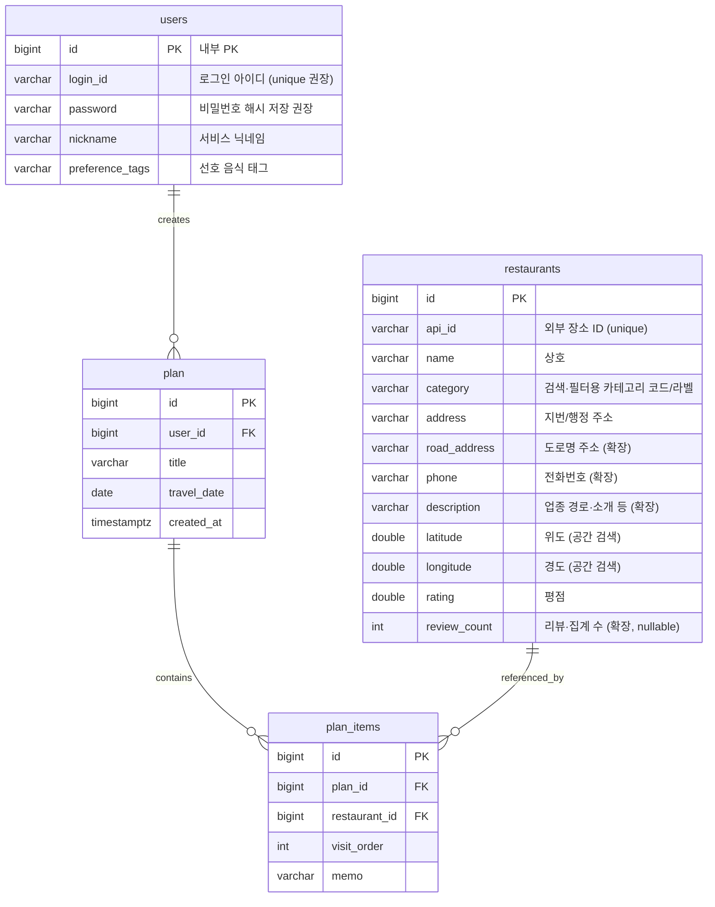

# Matzip DB — ERD (팀 기준 + 식당 테이블 확장)

팀에서 그린 초안 ERD를 유지하고, **식당 목록·상세·카카오 연동·지도·향후 통계**에 필요한 컬럼을 `restaurants`에 추가한 버전입니다.

---

## 1. 관계 다이어그램 (Mermaid)

다이어그램은 [GitHub / many Markdown 뷰어](https://github.blog/2022-02-14-include-diagrams-markdown-files-mermaid/)에서 렌더링됩니다.

---

## 2. 테이블 요약

### `users` (멤버 1 담당 예정)

| 컬럼            | 설명 |
|-----------------|------|
| `id`            | 내부 Surrogate PK |
| `login_id`      | 로그인 ID (초안 ERD의 “id”와 혼동 방지 위해 명시적으로 `login_id` 권장) |
| `password`      | BCrypt 등 해시 권장 |
| `nickname`      | 표시 이름 |
| `preference_tags` | 취향 태그 |

### `restaurants` (멤버 2 — 본 저장소 코드 기준)

**팀 초안과 동일한 핵심**

| 컬럼         | 설명 |
|--------------|------|
| `id`         | PK |
| `api_id`     | 외부 API(카카오) 고유 ID, 중복 적재 방지 |
| `name`       | 상호 |
| `category`   | 필터/검색용 |
| `address`    | 주소 |
| `latitude` / `longitude` | 지도 마커·PostGIS `ST_MakePoint` |
| `rating`     | 평점 |

**기능 구현을 위해 추가한 확장 컬럼** (`docs` / 발표 자료에 “확장”으로 적어두면 됨)

| 컬럼            | 설명 |
|-----------------|------|
| `road_address` | 도로명 주소 — 상세 페이지, 카카오 `road_address_name` |
| `phone`        | 전화·문의 — 카카오 `phone` |
| `description`  | 카카오 `category_name`(음식점＞한식＞… ) 등 부가 텍스트 |
| `review_count` | 초기 null 가능 — 추후 리뷰·일정 담김 횟수(트리거) 등과 연동 |

**공간 인덱스:** `latitude`·`longitude`로 만든 표현식 GIST  
→ `src/main/resources/db/dev-postgis.sql`

### `plan` / `plan_items` (멤버 3 담당 예정)

일정·순서·메모. `plan_items.restaurant_id` → `restaurants.id`.

---

## 3. Java 엔티티 필드 매핑 (`restaurants`)

Spring Data JPA 기본 네이밍으로 DB 컬럼은 `snake_case`로 생성됩니다.

| Java (`Restaurant`) | DB 컬럼 |
|----------------------|---------|
| `apiId`              | `api_id` |
| `roadAddress`        | `road_address` |
| `reviewCount`        | `review_count` |
| (그 외)              | camelCase → snake_case |

---

## 4. 마이그레이션 참고

`ddl-auto: update`만으로는 **삭제한 컬럼이 DB에 남을 수** 있습니다. 스키마를 맞춘 뒤 `dev-postgis.sql`의 GIST 인덱스를 다시 적용하세요.
