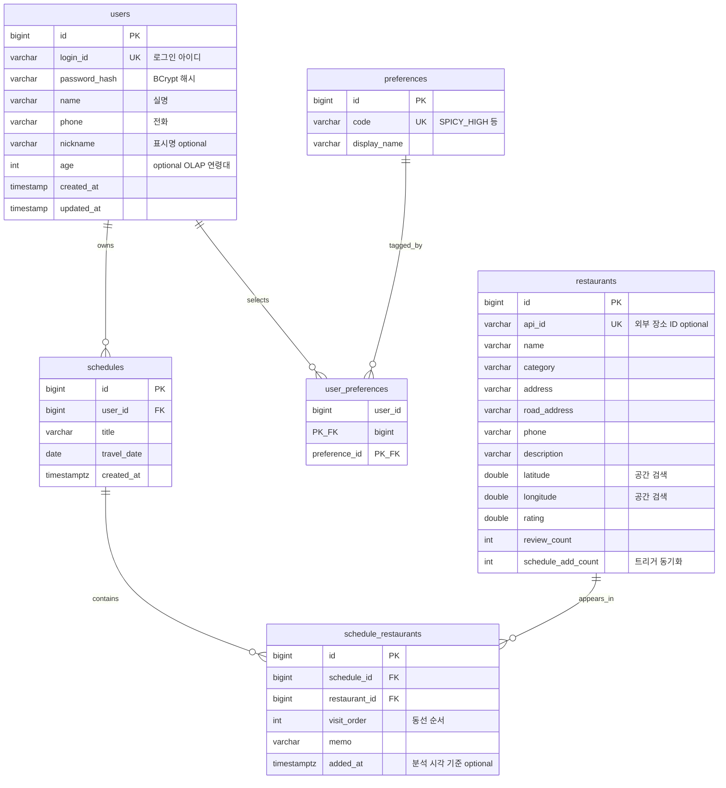

# Matzip DB — ERD (현행 정규 스키마)

[`schema.sql`](../src/main/resources/db/schema.sql) 과 동일한 도메인을 기준으로 합니다. 상세 서술은 **[database.md](database.md)** 를 참고하세요.

---

## 1. 관계 다이어그램 (Mermaid)

---

## 2. 레거시 초안과의 차이

팀 초안에 있던 **`plan` / `plan_items`** 명칭은 구현상 **`schedules` / `schedule_restaurants`** 로 매핑되었습니다.

평면형 **`schedules(user_id, restaurant_id, visit_date_time)`** 스키마는 [`schema_legacy_flat_schedules.sql`](../src/main/resources/db/schema_legacy_flat_schedules.sql) 에 보관되어 있습니다.

---

## 3. 공간 인덱스·마이그레이션

- GIST 인덱스 정의: [`postgis.sql`](../src/main/resources/db/postgis.sql)
- `ddl-auto: update` 만 사용하면 **삭제된 컬럼이 DB에 남을 수 있음** → 과제 제출 전 `schema.sql` 과 실제 DB를 한 번 비교하는 것을 권장합니다.
